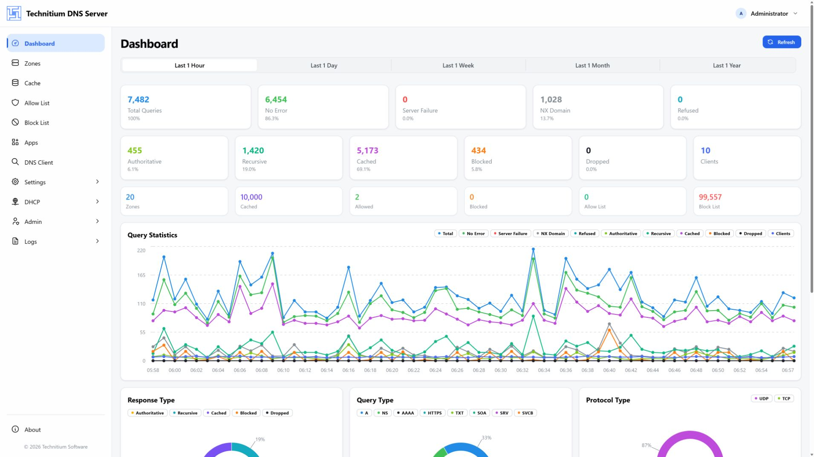
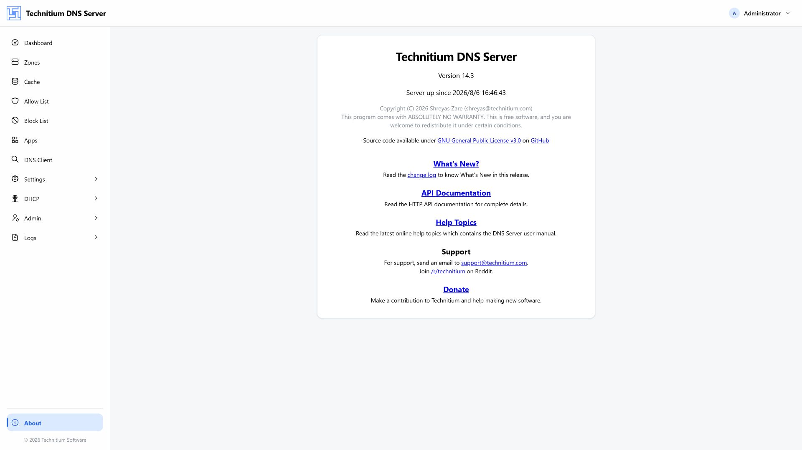

# Technitium DNS Server Web Console

[简体中文](./README.zh-CN.md) | English

A modern React administration console for [Technitium DNS Server](https://technitium.com/dns/). It provides a responsive interface for day-to-day DNS operations and is designed primarily for 1920 × 1080 desktop displays while remaining usable on tablets and phones.



## Highlights

- Real-time dashboard with query, response, cache, blocking, client, and protocol statistics
- Authoritative zone and DNS record management
- Cache, allow-list, and block-list browsing
- DNS application installation, updates, configuration, and removal
- Built-in DNS client for testing and troubleshooting
- Server, web service, protocol, recursion, cache, blocking, forwarding, and logging settings
- DHCP scope and lease management
- User, group, session, permission, and cluster administration
- Log viewing and query-log search
- English and Simplified Chinese localization
- Responsive navigation, forms, data tables, charts, and action areas

## Screenshot



## Technology stack

- React 19 and TypeScript
- Vite 7
- Mantine 9 and Tabler Icons
- TanStack Router and TanStack Query
- Jotai
- Recharts and Mantine Charts
- i18next
- CodeMirror 6
- Zod

## Requirements

- Node.js
- pnpm
- A running Technitium DNS Server instance with its HTTP API available

## Development

Install dependencies:

```bash
pnpm install
```

Create your local environment file and set it to your DNS server HTTP origin:

```bash
cp .env.example .env.local
```

```dotenv
VITE_API_PROXY_TARGET=http://localhost:5380
```

`.env.local` is ignored by Git and should not be committed. Then start the development server:

```bash
pnpm dev
```

The console is available at [http://localhost:3000](http://localhost:3000).

Router developer tools are disabled by default. To enable them locally, add the following to `.env.local`:

```dotenv
VITE_SHOW_ROUTER_DEVTOOLS=true
```

## Quality checks

```bash
pnpm type-check
pnpm lint
pnpm format:check
pnpm build
```

The production bundle is generated in `dist/`.

## Project structure

```text
src/
├── api/          HTTP API client
├── components/   Shared layout and UI components
├── locales/      English and Chinese translations
├── pages/        Feature pages and domain-specific components
├── routes/       TanStack Router route definitions
├── store/        Jotai application state
├── i18n.ts       Localization setup
└── theme.ts      Mantine theme configuration
```

## Backend integration

During development, Vite proxies `/api` and `/json` to the DNS server configured in `vite.config.ts`. Authentication uses the token returned by the Technitium DNS Server API. Production assets are intended to be served together with the DNS server web application.
