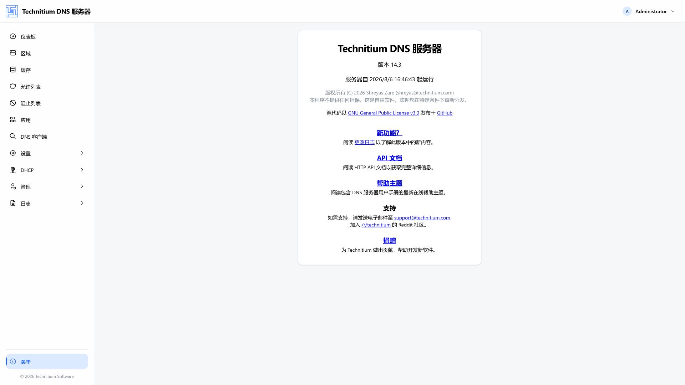

# Technitium DNS Server Web 控制台

简体中文 | [English](./README.md)

这是面向 [Technitium DNS Server](https://technitium.com/dns/) 的现代化 React 管理控制台，覆盖日常 DNS 运维所需的主要功能。界面以 1920 × 1080 桌面分辨率为主要设计目标，同时支持平板和手机端的响应式使用。


## 主要功能

- 实时仪表板：展示查询、响应、缓存、阻止、客户端和协议统计
- 权威区域与 DNS 记录管理
- 缓存、允许列表和阻止列表浏览
- DNS 应用的安装、更新、配置与卸载
- 内置 DNS 客户端，用于测试和故障排查
- 服务器、Web 服务、协议、递归、缓存、阻止、转发和日志设置
- DHCP 作用域与租约管理
- 用户、组、会话、权限和集群管理
- 日志查看与查询日志检索
- 英文和简体中文本地化
- 导航、表单、数据表格、图表和操作区的响应式布局

## 界面预览



## 技术栈

- React 19 与 TypeScript
- Vite 7
- Mantine 9 与 Tabler Icons
- TanStack Router 与 TanStack Query
- Jotai
- Recharts 与 Mantine Charts
- i18next
- CodeMirror 6
- Zod

## 环境要求

- Node.js
- pnpm
- 已运行并可访问 HTTP API 的 Technitium DNS Server 实例

## 本地开发

安装依赖：

```bash
pnpm install
```

复制环境变量模板，并将本地配置指向你的 DNS 服务器 HTTP 地址：

```bash
cp .env.example .env.local
```

```dotenv
VITE_API_PROXY_TARGET=http://localhost:5380
```

`.env.local` 已被 Git 忽略，不应提交到仓库。然后启动开发服务器：

```bash
pnpm dev
```

控制台默认访问地址为 [http://localhost:3000](http://localhost:3000)。

路由调试工具默认关闭。如需在本地启用，请在 `.env.local` 中加入：

```dotenv
VITE_SHOW_ROUTER_DEVTOOLS=true
```

## 质量检查

```bash
pnpm type-check
pnpm lint
pnpm format:check
pnpm build
```

生产构建产物会输出到 `dist/`。

## 项目结构

```text
src/
├── api/          HTTP API 客户端
├── components/   通用布局与界面组件
├── locales/      中英文翻译资源
├── pages/        功能页面与领域组件
├── routes/       TanStack Router 路由定义
├── store/        Jotai 应用状态
├── i18n.ts       国际化配置
└── theme.ts      Mantine 主题配置
```

## 后端集成

开发环境下，Vite 会将 `/api` 和 `/json` 请求代理到 `vite.config.ts` 中配置的 DNS 服务器。登录鉴权使用 Technitium DNS Server API 返回的令牌。生产环境构建产物适合与 DNS 服务器 Web 应用一同部署。
